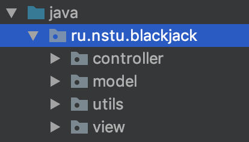
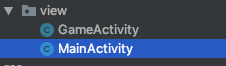
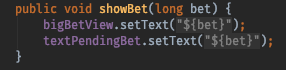
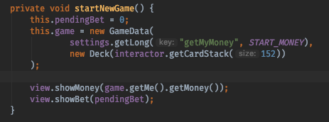
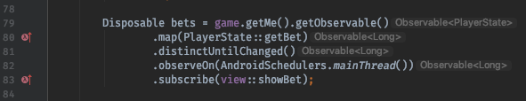
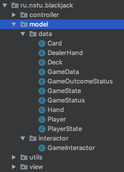
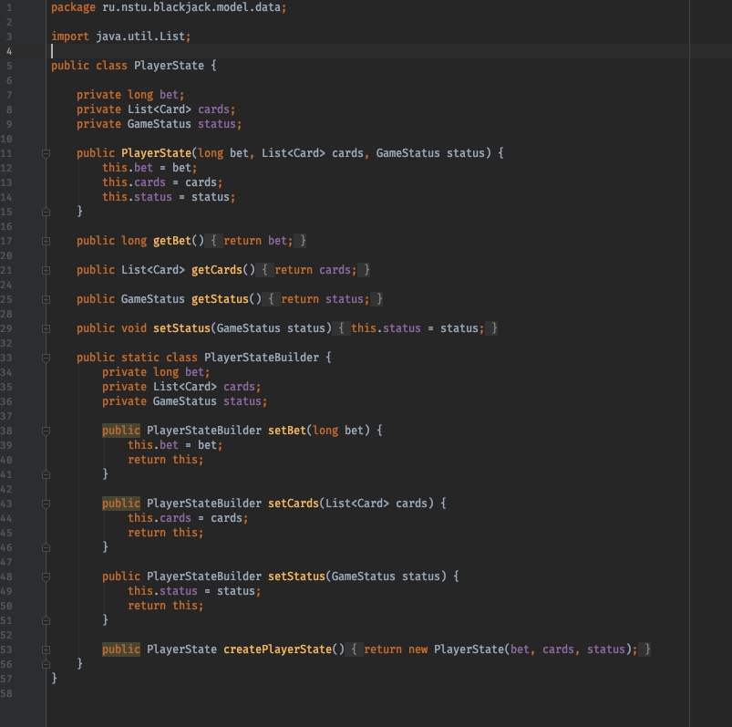
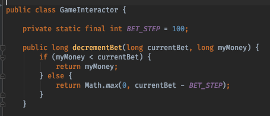
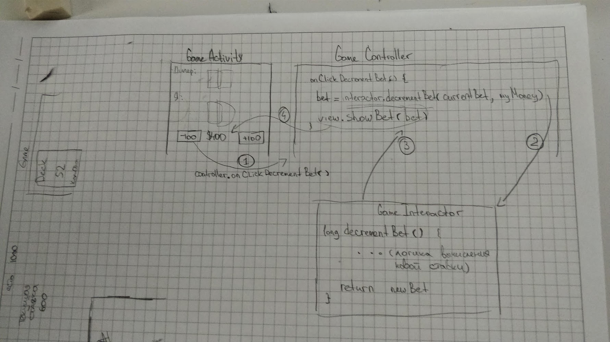

# Blackjack

Основной пакет приложения представляет из себя иерархическую структуру из 4х папок

model - содержит классы слоя Model: структуры данных и бизнес-логика

view - классы слоя View

controller - содержит классы слоя Controller приложения

utils - вспомогательные вещи для более удобной разработки

Класс MainActivity является точкой входа в приложения и не выполняет ничего, кроме перехода к основному экрану GameActivity

# View Layer

Класс GameActivity принадлежит слою View
Логика описанная в нем, касается только изменения состояния отображения. При этом данные приходят из вне и самостоятельно View никакие данные не запрашивает (следуя архитектурному паттерну MVC)

Рассмотрим более подробно одну из функций, чтобы убедиться в этом, например showBet

Мы видим, что функция не делает ничего кроме отображения значения, которое приходит ей в качестве аргумента. При этом, функция showBet вызывается из слоя Controller, а именно, из класса GameController

# Controller Layer

Рассмотрим класс контроллера, выполняющий склейку слоя отображения со слоем бизнес-логики

При старте новой игры (функция startNewGame()) выполняются подписки на изменения полей в моделях, посредством паттерна Observable, для более удобного отображения новых данных на view. Рассмотрим одну из таких подписок

 

В строчке 79 выполняется обращение к функции getMe() из объекта game, которая возвращает данные игрока (т.е. меня, как играющего).
В строчке 80 с помощью средств функционального программирования и функции map, из объекта Player (возвращенного функцией getMe()) вызывается функция getBet(), тем самым преобразуя результат в bet (по сути, это значит тоже самое что и game.getMe().getBet(), но другой записи, позволяющей в реактивном стиле реагировать на изменения модели).
В строчке 81 применяется функциональный оператор позволяющий исключить повторения тех же значения ставки, чтобы избежать повторной перерисовки UI.
В строчке 82 выполняется смена треда (потока выполнения программы) на главный, из-за ограничений ОС Андроид, требующий работы со вью только из главного потока.
В строке 83 выполняется подписка с применением предыдущих операторов и конечный результат передается в функцию showBet определенную в GameActivity (см. рисунок с кодом выше, там определена ее сигнатура и реализация)    

# Model layer

Слой модели содержит в себе 2 пакета (две папки) data и interactor
Пакет data содержит в себе Plain Java Objects (сокращенно pojo), обычные структуры данных без реализации логики внутри себя. Они только хранят данные. Рассмотрим одну из них 

Класс PlayerState описывает в себе состояние игрока, инкапсулируя в себе ставку, список карт и игровой статус. 
При этом, внутри класса поля имеют приватную область видимости, чтобы нельзя было случайно изменить значения. Доступ к полям осуществляется с помощью функций геттеров и сеттеров.
Помимо этого реализован класс PlayerStateBuilder на основе паттерна Builder позволяющий собирать объект вместо конструктора, оставляя другие поля опциональными для заполнения.

Пакет **interactor** содержит в себе всю необходимую логику для игры в блекджек, рассмотрим одну из функций этого класса

Фунция decrementBet вычисляет новое значения ставки, если пользователь решил ее уменьшить и возвращает измененное значение ставки.

Закрепим все что мы описали выше в виде диаграммы, для более ясного отображения логики

Шаг 1: Пользователь хочет уменьшить ставку и нажимает на кнопку "-100$"
Из View вызывается метод controller.onClickDecrementBet() сигнализирующий об этом (прошу обратить внимание, что из view отсылается только намерение о необходимости уменьшить ставку, а controller и interactor уже сами решают каким образом)

Шаг 2: Контроллер получает событие о необходимости уменьшить ставку и обращается к бизнес-логике interactor.decrementBet(currentBet, myMoney) передавая текущую ставку и количество денег у пользователя.

Шаг 3:  Интерактор вычислил новую величину ставки и вернул значение обратно контроллеру.

Шаг 4: Контроллер получил новое значение ставки и передал его для отображения view.

Таким образом, в ходе курсовой работы была реализована игра блекджек, на основе шаблона проектирования MVC.